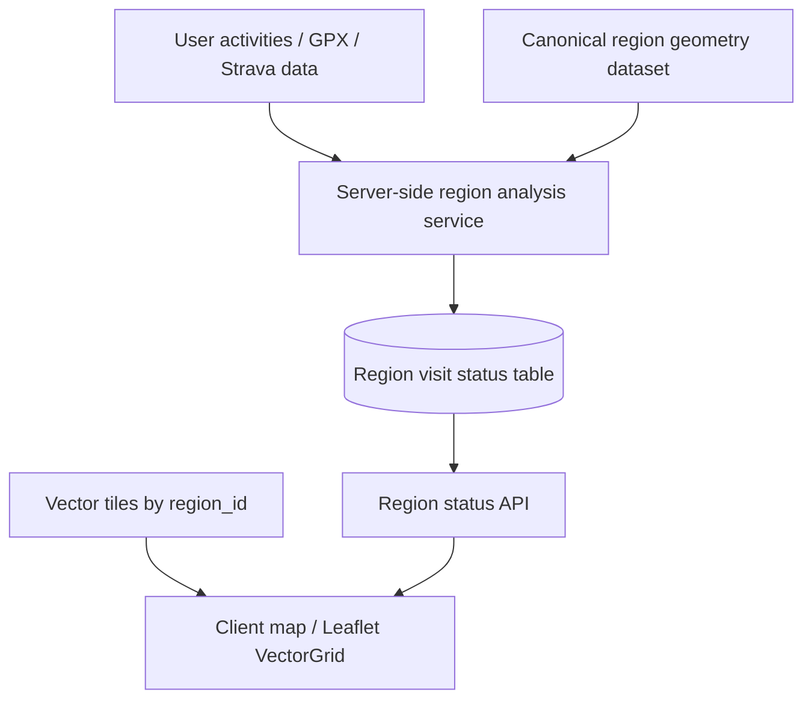

# Server-Side Region Visit Status Plan

**Status:** Proposed  
**Owner:** RegionRiders  
**Last updated:** 2026-04-08

## Context

The current map branch (`feature/ui/complete-region-display`) uses vector tiles for rendering region boundaries and styling. This is the right rendering direction, but visited/unvisited region analysis is not functionally complete end-to-end in the client.

Today:

- the client renders region geometry from vector tiles
- `useRegionRendering` can style regions by `region_id`
- `useRegionAnalysis` still expects full `Regions[]` geometry in the browser
- `MapOrchestrator` currently calls `useRegionAnalysis(tracks, [])`

This means the branch is ready for tile-based rendering, but not for a reliable long-term client-side region-analysis model.

The preferred direction is to move visited/unvisited region analysis to the server and store per-user region visit status in the database.

---

## Decision

### Rendering stays on the client

The client continues to:

- load vector tiles
- render region boundaries
- style regions by `region_id`

### Region visit analysis moves to the server

The server becomes responsible for:

- loading canonical region geometry
- analyzing user activity data against region geometry
- persisting region visit status
- returning stable region status records to the client

### The client consumes statuses, not full geometry

The browser should not need full `Polygon | MultiPolygon` region geometry to determine visited/unvisited state.

Instead, it should receive status records keyed by `region_id` and use those records to apply VectorGrid styling.

---

## Why This Approach

### Why not continue client-side analysis?

Because client-side analysis requires a separate runtime geometry source that is:

- complete
- stable
- aligned with tile `region_id`
- small enough to load safely in the browser

That adds a second geometry-delivery problem to the client and duplicates work that is more naturally performed on the backend.

### Why server-side analysis is better

Server-side analysis gives us:

- one canonical computation path
- consistent results across devices and sessions
- simpler frontend logic
- lower browser memory and CPU usage
- persistent visit status in the database
- easier reprocessing when activities or region datasets change

### Why vector tiles still matter

Vector tiles remain the correct rendering layer because they provide:

- efficient display
- zoom-aware geometry
- styling by `region_id`
- a stable map UI contract

The backend status model should complement the tile-rendering model, not replace it.

---

## Target Architecture



### Separation of concerns

- **Canonical geometry dataset**: used by backend analysis only
- **Vector tiles**: used by frontend rendering only
- **Region visit status records**: bridge between backend analysis and frontend styling

---

## Data Model

## Region identity

The shared key across all layers must be:

- `region_id`

This identifier must match across:

- canonical region geometry dataset
- vector tile features
- persisted visit status rows
- frontend styling contract

## Proposed status shape

```ts
type RegionVisitStatus = {
  regionId: string;
  visited: boolean;
  visitCount: number;
  lastVisitedAt?: string | null;
  datasetVersion: string;
};
```

## Proposed persistence model

Minimum table:

- `user_region_status`

Suggested fields:

- `user_id`
- `region_id`
- `visited`
- `visit_count`
- `last_visited_at`
- `dataset_version`
- `updated_at`

Optional second table for observability/rebuilds:

- `region_analysis_runs`

Suggested fields:

- `id`
- `user_id`
- `activity_source`
- `dataset_version`
- `started_at`
- `finished_at`
- `status`
- `error`

---

## Analysis Inputs

The backend analysis service needs two things:

### 1. Canonical region geometry

This must be a full geometry dataset with stable `region_id` values.

It should be aligned with the same region dataset version used to build vector tiles.

This geometry dataset is for server use and does not need to be exposed directly to the client.

### 2. User activity geometry

Possible inputs:

- uploaded GPX files
- persisted activity route points
- Strava-derived route geometry / streams

This requires one explicit product/engineering decision:

### Recommended rule

Use the highest-quality route geometry available for a given activity source, but normalize everything into one backend analysis input shape.

---

## Analysis Triggers

Region status should be recomputed when:

1. a new activity is imported
2. a GPX file is uploaded
3. activity geometry changes
4. the region dataset version changes
5. an explicit rebuild/recompute is requested

## Recommended strategy

### Phase 1

Run recomputation synchronously or near-synchronously after activity ingestion for the current user.

### Phase 2

Move recomputation into a background job queue if ingestion latency becomes a problem.

---

## API Design

The frontend should fetch persisted region statuses from a dedicated endpoint.

## Proposed endpoint

### `GET /api/region-status`

Returns current user region statuses for the active dataset version.

Example response:

```json
{
  "datasetVersion": "v1",
  "regions": [
    {
      "regionId": "RR1::PL::POM::001",
      "visited": true,
      "visitCount": 3,
      "lastVisitedAt": "2026-04-08T10:15:00.000Z"
    }
  ]
}
```

### Optional endpoint

### `POST /api/region-status/recompute`

Use only if explicit manual refresh is needed.

In many cases this should not be user-facing and can instead be triggered as part of ingestion.

---

## Frontend Integration

The client should stop treating region analysis as a browser-side responsibility.

## Target client flow

1. map loads vector tiles
2. client fetches region statuses for current user
3. client maps status records by `regionId`
4. `useRegionRendering` applies visited/unvisited styles using `setFeatureStyle(regionId, style)`

## Consequence

`useRegionAnalysis` becomes obsolete in the long-term map flow unless retained for a local/dev-only analysis mode.

## Recommendation

Do not extend the current client analysis path further if server-side analysis is the chosen direction.

---

## Dataset Versioning

Visited-region statuses must be tied to a region dataset version.

### Why

Because if:

- region boundaries change
- `region_id` mappings change
- tile datasets are rebuilt

then previously computed visit statuses may no longer be correct.

### Recommendation

Persist and serve:

- `dataset_version`

and ensure it matches the currently rendered tile dataset.

---

## Migration Plan

### Phase 1 — Infrastructure already in place

- vector tile rendering
- `region_id`-based styling
- tile source config
- fallback/error handling

### Phase 2 — Backend foundations

Build:

- canonical server-side geometry source
- activity geometry normalization path
- DB schema for region visit statuses
- server-side analysis service

### Phase 3 — Client status integration

Build:

- region status API
- client fetch hook / adapter
- VectorGrid styling from persisted statuses

### Phase 4 — Cleanup

- deprecate client-side `useRegionAnalysis` from production path
- keep only if explicitly needed for dev/testing

---

## Risks

### 1. Auth/session model is not fully finished

Per-user region status persistence depends on a reliable authenticated user identity.

Current Strava callback/session handling still needs completion.

### 2. Activity geometry quality may vary

Strava polylines, streams, and GPX uploads may differ in precision.

This can affect visit detection quality unless normalized deliberately.

### 3. Region dataset drift

Statuses are only trustworthy if analysis geometry and rendered tiles use the same `region_id` scheme and dataset version.

### 4. Recompute cost

Large user histories may make synchronous recomputation slow.

This is manageable initially but may require background jobs later.

---

## Success Criteria

This plan is successful if:

- the client renders regions from vector tiles only
- the server owns visited/unvisited computation
- persisted statuses are keyed by `region_id`
- the client styles regions from fetched statuses, not browser-side geometry analysis
- dataset version mismatches are avoided or detectable

---

## Summary

The recommended long-term architecture is:

- **render on the client via vector tiles**
- **analyze on the server using canonical geometry**
- **persist per-user region visit status in the database**
- **style regions in the client using fetched statuses keyed by `region_id`**

This avoids shipping full region geometry to the browser, keeps the client lightweight, and gives RegionRiders a more reliable foundation for visited/unvisited region behavior.
