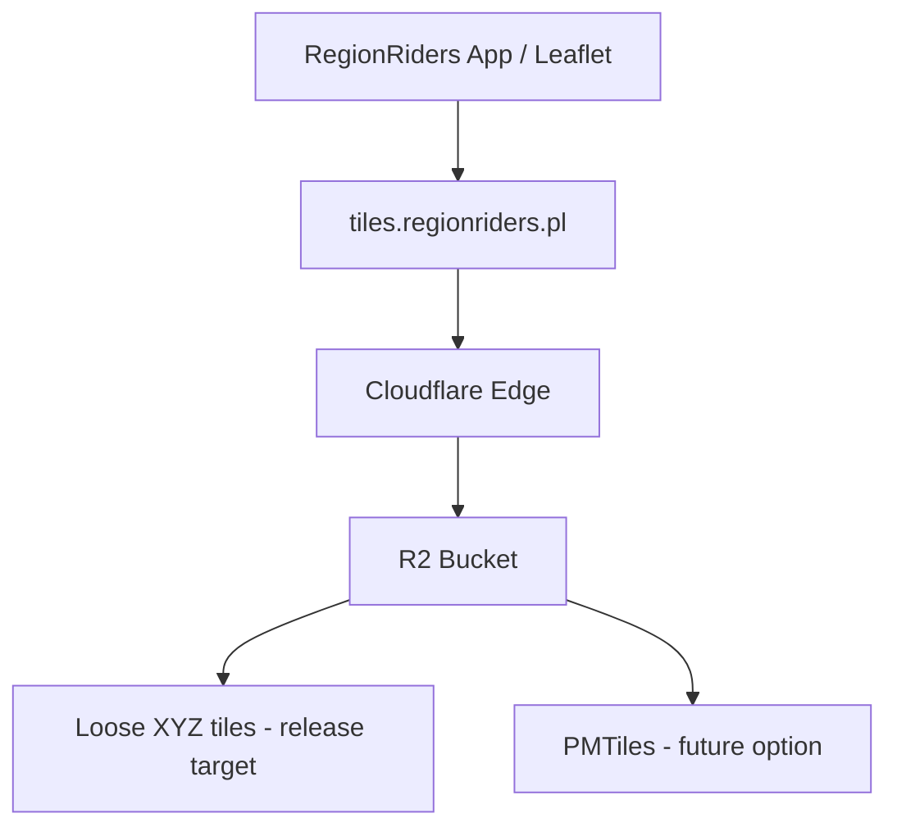
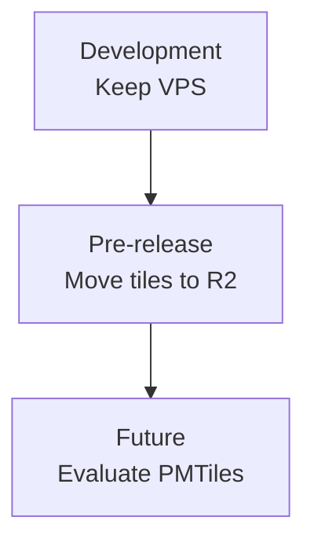
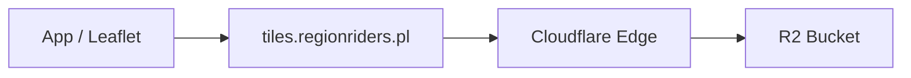
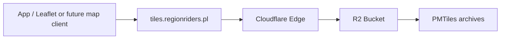

# Tile Hosting Migration Plan

**Status:** Proposed  
**Owner:** RegionRiders  
**Last updated:** 2026-04-08

## Context

RegionRiders is still in active development. The current VPS-based tile hosting is acceptable for local/dev usage and internal iteration.

That said, the current filesystem-based model is not a good long-term production fit if the tile pyramid grows toward higher zoom levels and a much larger corpus (potentially ~25M files). The main issue is not basic serving compatibility, but operational scale:

- huge file trees on VPS
- deploy/sync complexity
- backup/restore overhead
- awkward rollback/versioning
- poor ergonomics once the tile corpus becomes very large

Because the app has not been released yet, we do **not** need an intermediate “CDN in front of VPS” milestone as part of the main plan. The cleaner path is:

- keep VPS during development
- move production tiles to **Cloudflare R2 before first release**
- treat **PMTiles** as a future optimization, not a release blocker

---

## Decision

### Development phase

Keep the current VPS tile setup.

### Before first public release

Migrate tile hosting to **Cloudflare R2 on a custom domain**.

### Future optimization

Evaluate replacing loose XYZ tiles with **PMTiles** if object count and publication workflow become painful.

---

## Why This Approach

### Why not migrate to CDN-first now?

Because the app is still pre-release. Adding a temporary CDN stage in front of the VPS does not solve the real long-term problem: the storage and publication model.

If we can move directly to R2 before release, that is simpler and cleaner.

### Why R2 before v1?

Because first release is the right boundary to stop depending on a large VPS-hosted file tree.

R2 gives us:

- object storage instead of filesystem storage
- a much better fit for large tile corpora
- Cloudflare-native delivery on a custom domain
- a production-ready setup without overcomplicating the current development phase

### Why not PMTiles immediately?

Because PMTiles is a strategic improvement, not a hard prerequisite for v1.

If versioned loose tiles in R2 are enough for the first release, that is a reasonable shipping target. PMTiles can come later if the object-count model becomes too expensive operationally.

---

## Recommended Architecture



---

## Delivery Plan



---

## Stage 1 — Development

**Goal:** avoid unnecessary infrastructure work while the product is still being built.

### Guidance

- continue using the current VPS tile setup
- keep tile URLs and path conventions compatible with a later move to R2
- avoid introducing extra infra steps that do not help development directly

### Rationale

This is a temporary development posture, not the target production architecture.

---

## Stage 2 — Required Before First Release

**Goal:** ship v1 on a production-appropriate tile storage model.

### Target architecture



### Required work

1. Create an R2 bucket for production tiles
2. Attach a custom domain, e.g. `tiles.regionriders.pl`
3. Publish tiles using **versioned prefixes**
4. Point production tile URLs to the R2-backed domain
5. Configure cache rules for tile paths
6. Validate content types, caching, and rollback procedure

### Required path versioning

Good:

```text
regions/v2026-04/{z}/{x}/{y}.pbf
regions/v2026-05/{z}/{x}/{y}.pbf
```

Avoid:

```text
regions/{z}/{x}/{y}.pbf
```

### Why this stage is required

This is the minimum production-ready architecture. It removes the dependency on a large VPS file tree without forcing a bigger redesign.

### Release gate

The first public release should not ship until:

- tiles are served from R2
- versioned publishing is in place
- rollback is documented
- cache behavior is verified

---

## Stage 3 — Future Optimization

**Goal:** reduce operational complexity if loose XYZ tiles become painful at scale.

### Target architecture



### Why this matters

R2 with loose XYZ files is workable, but still leaves us with a very high object count.

PMTiles improves:

- deployment ergonomics
- rollback/versioning
- storage publication workflow
- long-term maintainability

### Why it is not a release blocker

Loose XYZ in R2 is already a meaningful step up from VPS hosting. PMTiles should be treated as the next optimization, not a prerequisite for shipping.

---

## Rejected / Non-Primary Paths

### VPS as long-term production origin

Not recommended. Acceptable in development, weak as the long-term production model.

### Cloudflare Pages

Rejected due to file-count limits.

### Workers static assets

Rejected due to file-count limits.

### Worker in hot path for every tile

Not the default choice. Only justified if we later need request-time logic such as auth, rewriting, or custom TileJSON behavior.

### CDN in front of VPS as a required migration milestone

Not part of the main plan. It is optional, but unnecessary if we can move directly to R2 before release.

---

## Success Criteria

This plan is successful if:

- development remains simple
- first public release serves tiles from R2, not VPS
- tile publication is versioned
- rollback is practical
- future PMTiles migration remains possible without reworking the entire setup

---

## Summary

The recommended path for RegionRiders is straightforward:

- **now:** keep VPS during development
- **before v1:** move tiles to **Cloudflare R2**
- **later:** evaluate **PMTiles** if tile scale starts hurting operationally

This keeps the current phase lightweight while ensuring the first release ships on a saner production architecture.
